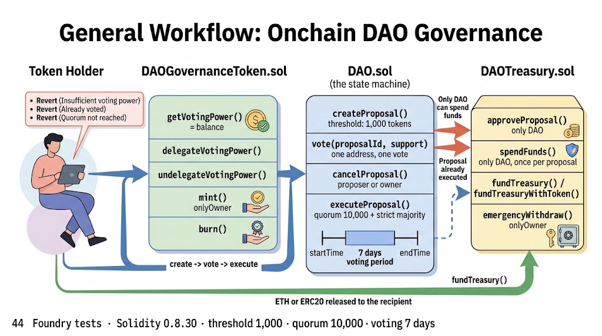

<div align="center">
  <h1>🏛️ DAO — Governance, Treasury and Voting Power</h1>
  <p><b>An onchain governance system with ERC20 voting power, a proposal lifecycle and a treasury that only pays out what token holders approve</b></p>
</div>

## 📖 About the Project

**DAO** is a production-ready Web3 governance protocol built with **Solidity** `0.8.30` and thoroughly tested using the **Foundry** framework. Governance is split across three contracts: `DAOGovernanceToken` carries voting power and delegation, `DAO` runs the full proposal lifecycle, and `DAOTreasury` holds the funds and can only release them when the DAO itself approves a spending proposal.

The design keeps authority separated in the same shape a real protocol needs it. Token holders create proposals to move ETH or ERC20 assets, vote during a fixed window, and the proposal executes only if it clears both the quorum and the majority rule. The treasury never trusts a caller: it accepts approvals exclusively from the DAO contract and refuses to spend a proposal id twice, so a compromised or malicious proposer cannot drain funds by calling the treasury directly.

**Key Technical Highlights:**
* **Solidity `0.8.30` with `viaIR`:** IR-based compilation for a cleaner optimizer pipeline on the multi-struct governance logic.
* **OpenZeppelin Contracts:** `ERC20` and `Ownable` as the base layer, with a governance token that adds delegation on top.
* **Foundry Framework:** A 44-case suite covering the token, the delegation accounting, every treasury guard and the full proposal lifecycle including quorum failure.
* **Two-step spending:** `approveProposal` and `spendFunds` are separate calls, both restricted to the DAO, and each proposal id can only be executed once.
* **Configurable governance:** Proposal threshold, voting period and quorum are constructor parameters and can be updated by the owner through `updateConfiguration`.

---

## ⚙️ How It Works

`DAOGovernanceToken` is an ERC20 whose balance *is* the voting power: `getVotingPower(account)` returns `balanceOf(account)`, so holding more tokens means more weight in every vote. On top of the standard transfers, the token adds a delegation layer — `delegateVotingPower` moves tokens to a delegate and records the amount, `undelegateVotingPower` moves them back — plus an owner-only `mint` and a permissionless `burn` that lets any holder destroy their own tokens.

`DAO` is the state machine. A proposal stores its proposer, description, recipient, amount, token, vote tallies, the voting window and two flags (`executed`, `canceled`), with a per-address record of whether someone voted and in which direction. Creating a proposal requires the caller to hold at least `s_proposalThreshold` voting power; the window opens immediately and closes after `s_votingPeriod`. Each address votes once, with the weight of its balance at the moment of the vote, and the proposal can be canceled by its proposer or by the DAO owner while it is still pending.

Execution is gated by three conditions: the voting period must be over, the combined tally (`forVotes + againstVotes`) must reach `s_quorumVotes`, and the outcome must be a strict majority of `forVotes` over `againstVotes`. When they hold, `executeProposal` marks the proposal as executed — before any external call, so it cannot be replayed — and then calls the treasury twice: first `approveProposal` to register the id, then `spendFunds` to transfer the ETH or ERC20 to the recipient.

`DAOTreasury` accepts funds with no restrictions: `fundTreasury` for ETH, `fundTreasuryWithToken` for ERC20, and a `receive` function so a plain transfer also funds it. Outflows are the opposite — both `approveProposal` and `spendFunds` check `msg.sender == address(dao)`, `spendFunds` additionally requires the proposal to be approved and not already executed, and it verifies the contract holds enough ETH or tokens before transferring. An owner-only `emergencyWithdraw` exists as a break-glass path for assets sent to the treasury by mistake.

### Architecture Diagram



### Core Component File Paths

[DAOGovernanceToken.sol](./src/DAOGovernanceToken.sol) - ERC20 governance token with voting power and delegation

[DAO.sol](./src/DAO.sol) - Proposal lifecycle: creation, voting, cancellation and execution

[DAOTreasury.sol](./src/DAOTreasury.sol) - Fund custody with DAO-gated approvals and spending

[IDAOTreasury.sol](./src/interfaces/IDAOTreasury.sol) - Minimal interface the DAO uses to instruct the treasury

[DaoTest.t.sol](./test/DaoTest.t.sol) - Foundry suite covering the token, the treasury and the full governance flow

## 💻 Technical Docs

The primary interaction points are `createProposal` and `vote` (governance), `executeProposal` (the payout trigger), `delegateVotingPower` (voting-power transfer) and `spendFunds` (the only path out of the treasury).

### createProposal
File: src/DAO.sol

```Solidity
    function createProposal(string memory description, address recipient, uint256 amount, address token)
        external
        returns (uint256 proposalId)
    {
        require(
            s_governanceToken.getVotingPower(msg.sender) >= s_proposalThreshold,
            "Insufficient voting power to create proposal"
        );
        require(bytes(description).length > 0, "Description cannot be empty");
        require(recipient != address(0), "Invalid recipient address");
        require(amount > 0, "Amount must be greater than 0");

        proposalId = s_proposalCount++;
        Proposal storage proposal = s_proposals[proposalId];

        proposal.id = proposalId;
        proposal.proposer = msg.sender;
        proposal.description = description;
        proposal.recipient = recipient;
        proposal.amount = amount;
        proposal.token = token;
        proposal.startTime = block.timestamp;
        proposal.endTime = block.timestamp + s_votingPeriod;
        proposal.executed = false;
        proposal.canceled = false;

        emit ProposalCreated(
            proposalId,
            proposal.proposer,
            proposal.description,
            proposal.recipient,
            proposal.amount,
            proposal.token,
            proposal.startTime,
            proposal.endTime
        );
    }
```

### vote
File: src/DAO.sol

```Solidity
    function vote(uint256 proposalId, bool support) external {
        Proposal storage proposal = s_proposals[proposalId];
        require(proposal.proposer != address(0), "Proposal does not exists");
        require(block.timestamp >= proposal.startTime, "Voting not started");
        require(block.timestamp < proposal.endTime, "Voting ended");
        require(!proposal.hasVoted[msg.sender], "Already voted");
        require(!proposal.canceled, "Proposal has been canceled");
        require(!proposal.executed, "Proposal already executed");

        uint256 votes = s_governanceToken.getVotingPower(msg.sender);
        require(votes > 0, "No voting power");

        proposal.hasVoted[msg.sender] = true;
        proposal.votedFor[msg.sender] = support;

        if (support) {
            proposal.forVotes += votes;
        } else {
            proposal.againstVotes += votes;
        }

        emit Voted(proposalId, msg.sender, support, votes);
    }
```

### executeProposal
File: src/DAO.sol

```Solidity
    function executeProposal(uint256 proposalId) external {
        Proposal storage proposal = s_proposals[proposalId];

        require(proposal.proposer != address(0), "Proposal does not exists");
        require(block.timestamp >= proposal.endTime, "Voting not ended");
        require(!proposal.executed, "Proposal already executed");
        require(!proposal.canceled, "Proposal is canceled");
        require(proposal.forVotes + proposal.againstVotes >= s_quorumVotes, "Quorum not reached");
        require(proposal.forVotes > proposal.againstVotes, "Proposal not passed");

        proposal.executed = true;

        s_treasury.approveProposal(proposalId);

        s_treasury.spendFunds(proposalId, proposal.recipient, proposal.amount, proposal.token);

        emit ProposalExecuted(proposalId);

    }
```

### delegateVotingPower
File: src/DAOGovernanceToken.sol

```Solidity
    function delegateVotingPower(address delegate, uint256 amount) external {
        require(delegate != address(0), "Cannot delegate to zero address");
        require(delegate != msg.sender, "Cannot delegate to self");
        require(amount > 0, "Amount must be greater than 0");
        require(balanceOf(msg.sender) >= amount, "Insufficient balance");

        _transfer(msg.sender, delegate, amount);

        s_delegates[msg.sender] = delegate;
        s_delegatedVotes[delegate] += amount;
        s_hasDelegated[msg.sender] = true;

        emit VotingPowerDelegated(msg.sender, delegate, amount);

    }
```

### spendFunds
File: src/DAOTreasury.sol

```Solidity
    function spendFunds(uint256 proposalId, address recipient, uint256 amount, address token) external {
        require(msg.sender == address(dao), "Only DAO can spend funds");
        require(s_approvedProposals[proposalId], "Proposal not approved");
        require(!s_executedProposals[proposalId], "Proposal already executed");
        require(recipient != address(0), "Invalid recipient");
        require(amount > 0, "Amount must be greater than 0");

        s_executedProposals[proposalId] = true;

        if (token == address(0)) {
            // Send ETH
            require(address(this).balance >= amount, "Insufficient ETH balance");
            (bool success,) = recipient.call{value: amount}("");
            require(success, "ETH transfer failed");
        } else {
            // ERC20
            IERC20 tokenContract = IERC20(token);
            require(tokenContract.balanceOf(address(this)) >= amount, "Insufficient token balance");
            require(tokenContract.transfer(recipient, amount), "Token transfer failed");
        }

        emit FundsSpend(proposalId, recipient, amount, token);
    }
```

## 🚀 Execution Example

Here is a step-by-step example of a full governance cycle.

- Step 1: Deploy and wire
The deploy script creates the token with `1,000,000` tokens minted to the owner, the treasury with the owner as its owner, and the DAO with a `1,000` token proposal threshold, a `7 days` voting period and a `10,000` token quorum. Because the treasury needs the DAO address and the DAO needs the treasury address, the script finishes with `setDAO`, which is a one-time wiring call restricted to the treasury owner.

- Step 2: Fund the treasury
Anyone can fund it: `fundTreasury()` with ETH, `fundTreasuryWithToken(token, amount)` with an ERC20 after an approval, or a plain transfer, which lands in the `receive` function. All three emit `TreasuryFunded`.

- Step 3: Create a proposal
A holder with at least `1,000` tokens calls `createProposal(description, recipient, amount, token)` — passing `address(0)` as the token means ETH. The call validates that the description is not empty, the recipient is not the zero address and the amount is greater than zero, then opens a voting window of seven days and emits `ProposalCreated` with the full payload.

- Step 4: Vote
Any holder with a non-zero balance calls `vote(proposalId, support)` during the window. Voting power is read at that moment, one address votes once, and the tally goes to `forVotes` or `againstVotes` accordingly. Voting after `endTime`, voting twice, voting on a canceled or executed proposal, or voting with a zero balance all revert.

- Step 5: Cancel if needed
While the proposal is still pending, its proposer — or the DAO owner — can call `cancelProposal`, which sets the flag and permanently blocks execution.

- Step 6: Execute
Once the window closes, anyone can call `executeProposal`. It requires the combined tally to reach the `10,000` token quorum and a strict majority of votes in favor. On success it flips `executed` to true first, then instructs the treasury: `approveProposal` registers the id and `spendFunds` releases the ETH or ERC20 to the recipient. If the quorum is missed or the votes tie, the call reverts and the treasury stays untouched.

- Step 7: Delegate voting power
A holder who does not want to vote directly calls `delegateVotingPower(delegate, amount)`: the tokens are transferred to the delegate, the delegation is recorded and `VotingPowerDelegated` is emitted. Since voting power follows the balance, the delegate now votes with the combined weight. `undelegateVotingPower(amount)` reverses it, clearing the delegation record once the delegated amount reaches zero.

- Step 8: Break-glass path
If assets end up in the treasury outside governance, the treasury owner can recover them with `emergencyWithdraw(token, amount, recipient)`, which handles both ETH and ERC20. This is the only path that bypasses the DAO, and it is owner-restricted by design.

## ⬆️ Installation

Two dependencies are wired as git submodules: `forge-std` and `openzeppelin-contracts`.

```Bash
git clone --recursive https://github.com/k2gutierrez/dao.git
cd dao
forge build
```

## 🧪 Testing

`test/DaoTest.t.sol` is a 44-case suite that runs entirely in-process — no fork or RPC endpoint is required. It covers token minting and burning permissions, every delegation and undelegation path (including the zero address, self-delegation, zero amount and insufficient balance guards), treasury funding in ETH and ERC20, the DAO-only restrictions on `approveProposal` and `spendFunds`, double-approval and double-spend protection, emergency withdrawals, and the full proposal lifecycle: creation, threshold rejection, voting both ways, cancellation, quorum failure and successful execution.

Testing command:
```Bash
forge test -vvv
```

> ⚠️ The committed CI workflow runs `forge fmt --check` and currently fails, because the source files are not formatted to `forge fmt` defaults. Running `forge fmt` fixes it; `forge test` itself passes as-is.

## 📊 Coverage

```Bash
forge coverage
```
